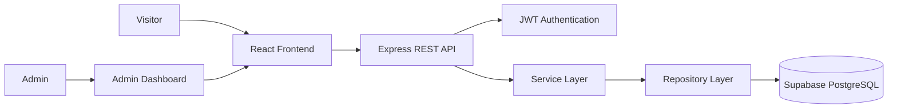
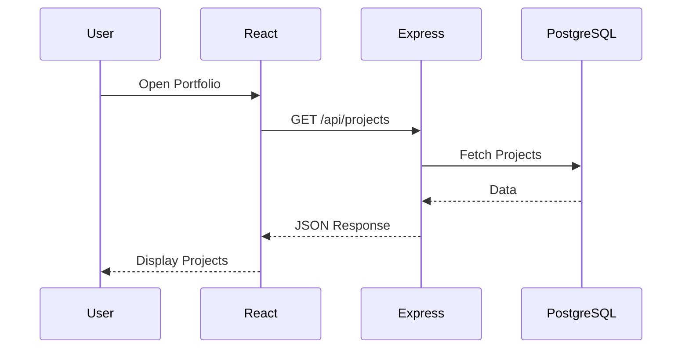

# Full Stack Portfolio Website

A modern full-stack portfolio application built with **React**, **Node.js**, **Express**, and **PostgreSQL**. The project features a responsive public portfolio alongside a secure admin dashboard for managing portfolio content without modifying the source code.

---

## 🌐 Live Demo

**Website:** https://portfolio-two-henna-63.vercel.app/

### Deployment

| Service | Platform |
| -------- | -------- |
| Frontend | Vercel |
| Backend | Render |
| Database | Supabase PostgreSQL |

---

## ✨ Features

### Public Portfolio

- Responsive landing page
- Dynamic Hero section
- Dynamic About section
- Dynamic Skills section
- Dynamic Projects showcase
- Contact section
- Smooth scrolling navigation
- Active section highlighting

### Admin Dashboard

- Secure JWT authentication
- Protected admin routes
- Dashboard statistics
- Hero management
- About management
- Projects CRUD
- Skills CRUD
- Messages inbox

---

## 🛠 Tech Stack

| Layer | Technology |
| --- | --- |
| Frontend | React 19, Vite, Tailwind CSS |
| Routing | React Router DOM |
| HTTP Client | Axios |
| Icons | React Icons |
| Backend | Node.js, Express.js |
| Database | PostgreSQL (Supabase) |
| Database Client | pg (node-postgres) |
| Authentication | JWT, bcrypt |
| Deployment | Vercel, Render |

---

## 🏗 Architecture



---

## 📂 Project Structure

```text
Portfolio/
│
├── Backend/
│   ├── config/
│   ├── controllers/
│   ├── middleware/
│   ├── migrations/
│   ├── repositories/
│   ├── routes/
│   ├── services/
│   ├── utils/
│   ├── app.js
│   ├── server.js
│   └── package.json
│
└── Frontend/
    ├── src/
    │   ├── admin/
    │   ├── api/
    │   ├── components/
    │   ├── context/
    │   ├── pages/
    │   ├── routes/
    │   ├── styles/
    │   ├── utils/
    │   ├── App.jsx
    │   └── main.jsx
    ├── index.html
    ├── vite.config.js
    ├── vercel.json
    └── package.json
```

---

## 🚀 Getting Started

### Prerequisites

- Node.js
- npm
- PostgreSQL

### Clone Repository

```bash
git clone <repository-url>
cd Portfolio
```

---

## 📦 Install Dependencies

### Backend

```bash
cd Backend
npm install
```

### Frontend

```bash
cd Frontend
npm install
```

---

## ⚙ Environment Variables

### Backend (`Backend/.env`)

```env
POSTGRES_URI=your_supabase_connection_string

NODE_ENV=development

JWT_SECRET=your_super_secret_key

FRONTEND_URL=http://localhost:5173
```

### Frontend (`Frontend/.env`)

```env
VITE_API_URL=http://localhost:5000/api
```

---

## 🗄 Database Setup

Create a PostgreSQL database.

Execute the SQL files inside:

```text
Backend/migrations/
```

Recommended order:

```text
admins.sql
heroSection.sql
about.sql
projects.sql
skills.sql
messages.sql
```

Insert the initial row for:

- hero_section
- about

Both update operations expect `id = 1`.

---

## ▶ Running Locally

### Backend

```bash
cd Backend
npm start
```

Runs on

```
http://localhost:5000
```

### Frontend

```bash
cd Frontend
npm run dev
```

Runs on

```
http://localhost:5173
```

---

## 🔐 Authentication

Admin Login

```
/admin/login
```

JWT authentication is used for all protected endpoints.

Authorization header

```text
Authorization: Bearer <token>
```

---

## 📡 API Overview

Base URL

```
/api
```

### Authentication

| Method | Endpoint | Protected |
| ------ | -------- | --------- |
| POST | /admin/login | ❌ |
| GET | /admin/profile | ✅ |

### Hero

| Method | Endpoint | Protected |
| ------ | -------- | --------- |
| GET | /hero | ❌ |
| PUT | /hero | ✅ |

### About

| Method | Endpoint | Protected |
| ------ | -------- | --------- |
| GET | /about | ❌ |
| PUT | /about | ✅ |

### Projects

| Method | Endpoint | Protected |
| ------ | -------- | --------- |
| GET | /projects | ❌ |
| GET | /projects/count | ❌ |
| POST | /projects | ✅ |
| PUT | /projects/:id | ✅ |
| DELETE | /projects/:id | ✅ |

### Skills

| Method | Endpoint | Protected |
| ------ | -------- | --------- |
| GET | /skills | ❌ |
| GET | /skills/count | ❌ |
| POST | /skills | ✅ |
| PUT | /skills/:id | ✅ |
| DELETE | /skills/:id | ✅ |

### Messages

| Method | Endpoint | Protected |
| ------ | -------- | --------- |
| GET | /messages | ✅ |

---

## 🧭 Frontend Routes

| Route | Description |
| ------ | ----------- |
| / | Portfolio |
| /admin/login | Admin Login |
| /admin/dashboard | Dashboard |
| /admin/hero | Hero Management |
| /admin/about | About Management |
| /admin/projects | Projects CRUD |
| /admin/skills | Skills CRUD |
| /admin/messages | Messages Inbox |

---

## 📊 Request Flow



---

## 🏗 Build

Build frontend

```bash
cd Frontend
npm run build
```

Preview production build

```bash
npm run preview
```

---

## ☁ Deployment

### Frontend

- Hosted on **Vercel**

### Backend

- Hosted on **Render**

### Database

- Hosted on **Supabase PostgreSQL**

The frontend includes a `vercel.json` configuration to support React Router SPA rewrites, enabling direct navigation to routes such as:

```
/admin/login

/admin/dashboard
```

### Production Environment Variables

Frontend

```env
VITE_API_URL=https://your-render-backend.onrender.com/api
```

Backend

```env
POSTGRES_URI=your_supabase_connection_string

FRONTEND_URL=https://portfolio-two-henna-63.vercel.app

JWT_SECRET=your_super_secret
```

---

## 📌 Future Improvements

- Image uploads with Cloudinary
- Rich text editor
- Project categories & filtering
- Contact email notifications
- Analytics dashboard
- Dark/Light mode
- Resume download management

---

## 📸 Screenshots

Add screenshots here after deployment.

### Home Page

```
assets/home.png
```

### Projects

```
assets/projects.png
```

### Admin Dashboard

```
assets/dashboard.png
```

### Mobile View

```
assets/mobile.png
```

---

## 📄 License

This project is licensed under the MIT License.